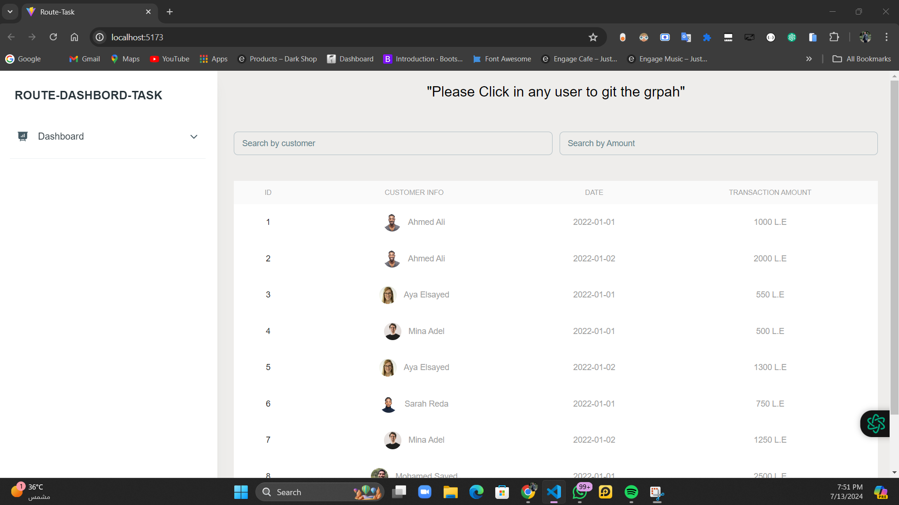
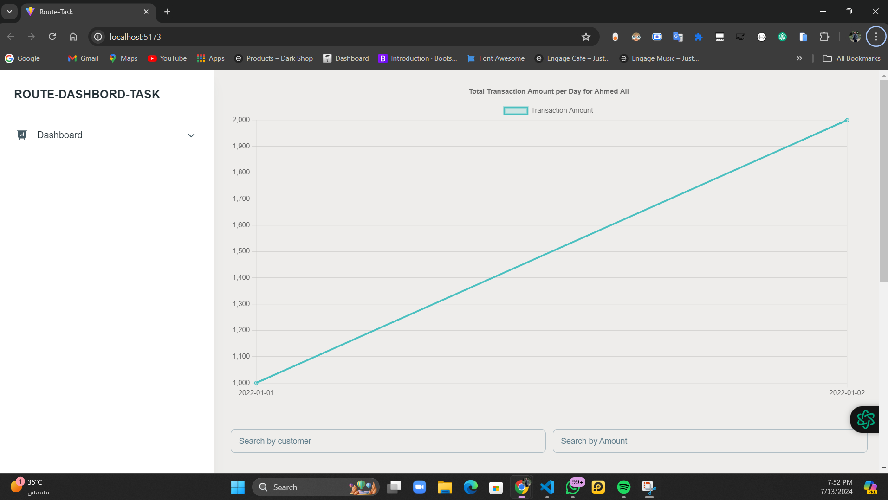

# React + Vite
# Customer Transactions App

;
;

## Description

This project is a customer transactions application built using React.js with Vite. The application retrieves customer and transaction data from a local JSON server and displays it in a user-friendly format.

### Features
- A table that displays the list of customers along with their transaction data.
- Ability to filter the table by customer name or transaction amount.
- A graph that displays the total transaction amount per day for the selected customer.

### Technologies Used
- **React.js** (with Vite)
- **JSON Server** (for local data hosting ) (npx json-server --watch db.json --port 5001
)
- **Tailwind CSS** and **Material Tailwind UI** (for styling)
- **Axios** (for fetching data)
- **Chart.js** (for the graph)
- **React Awesome Reveal** (for animations)

